# 🧠 NeuroPlan — Smart Study Planner

A modern AI-powered study planning system designed to help students organize, prioritize, and optimize their learning journey.

Built with a clean dashboard experience and intelligent planning logic, NeuroPlan transforms raw study data into actionable insights.


---
## 🚀 Features

- 📊 Smart Study Planning based on deadlines & difficulty
- 📈 Progress Tracking with detailed logs
- 🧠 AI-powered PDF summarization & keyword extraction
- 📅 Weekly Study Plan generator
- 📊 Advanced Analytics & performance insights
- 👤 Authentication system (login/register)
- 📤 Export plans (CSV / PDF)
- 🎯 Weak area detection & recommendations

## 🚀 Overview

Smart Study Planner is a full-featured productivity application built with **Python + Streamlit**, designed to solve a real problem:

> Students don’t know what to study, when to study, or how to structure their time effectively.

This system transforms scattered study efforts into a **clear, trackable, and adaptive plan**.

---

## 🧱 Tech Stack

- Python
- Streamlit
- SQLite
- Pandas
- PyPDF2
- ReportLab

---

## 📸 Screenshots

### Dashboard
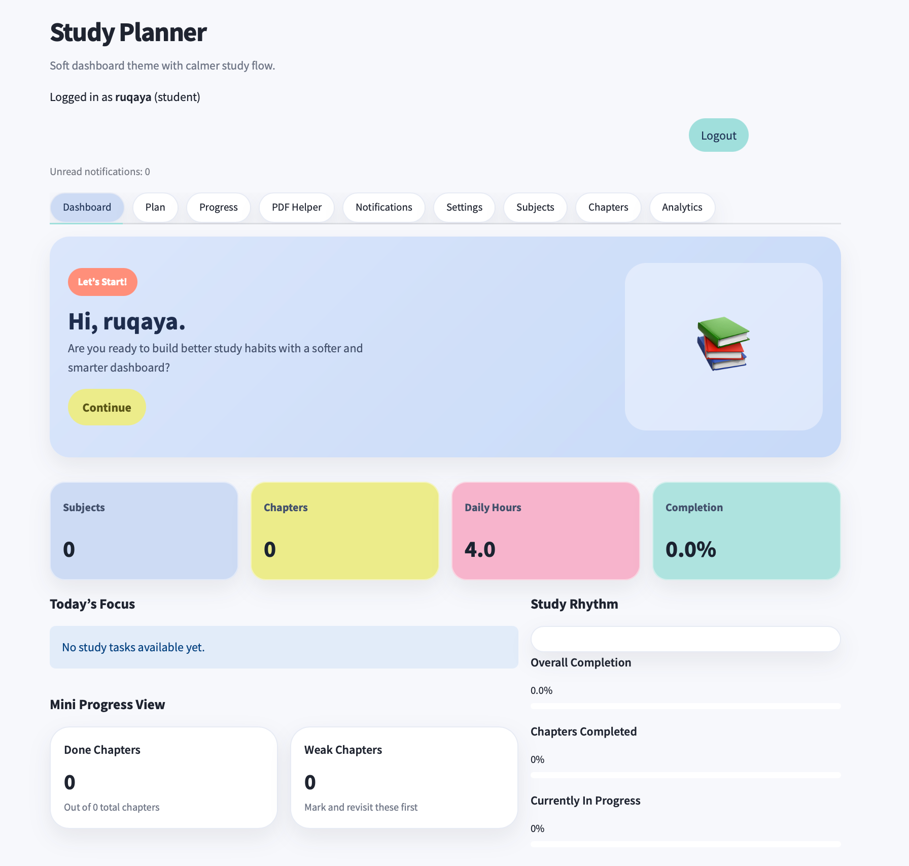
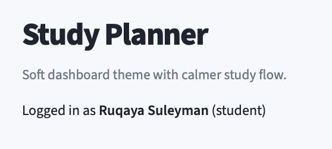
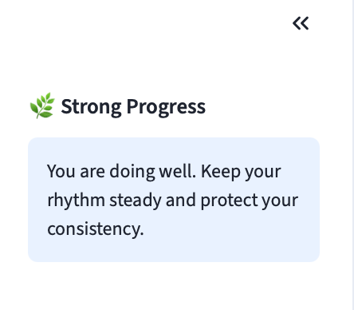

---

### Study Plan
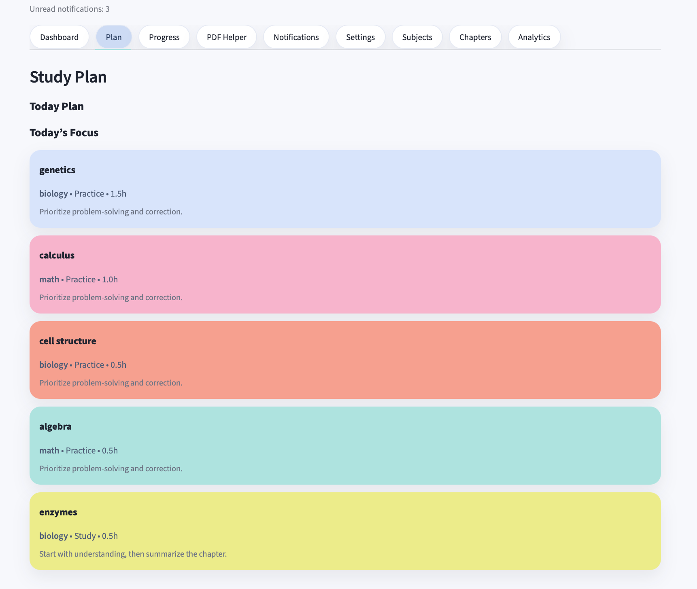
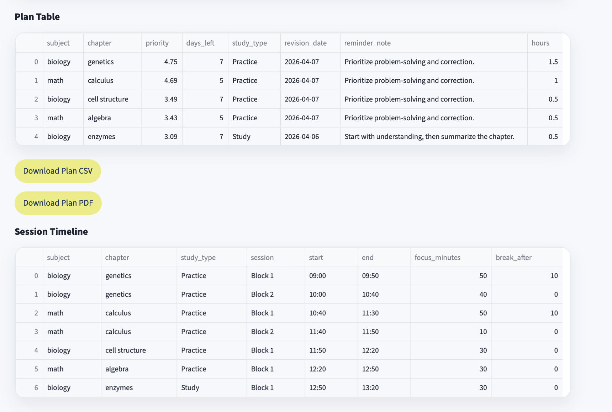
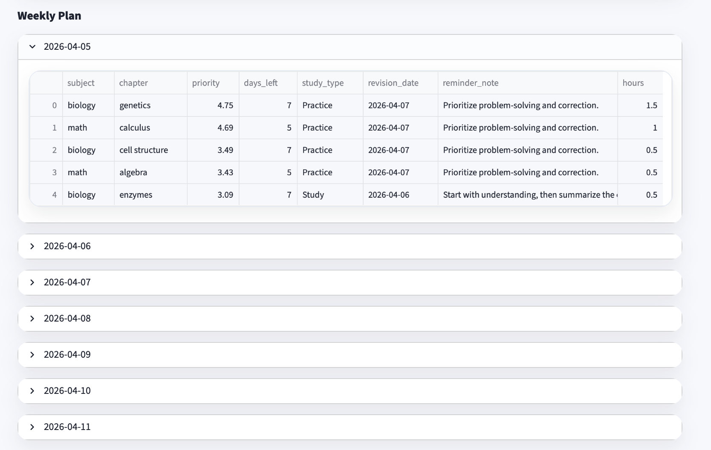

---

### Progress Tracking
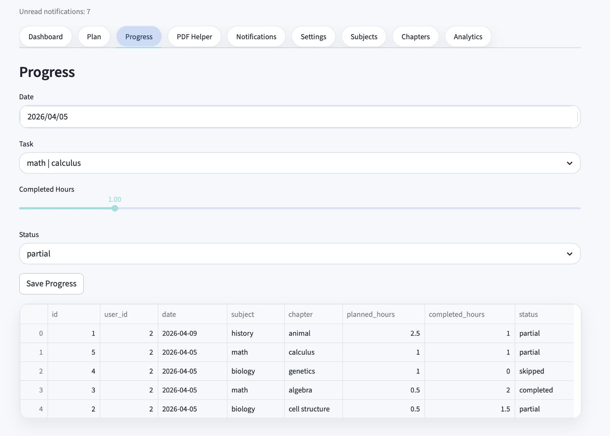

---

### PDF Study Helper
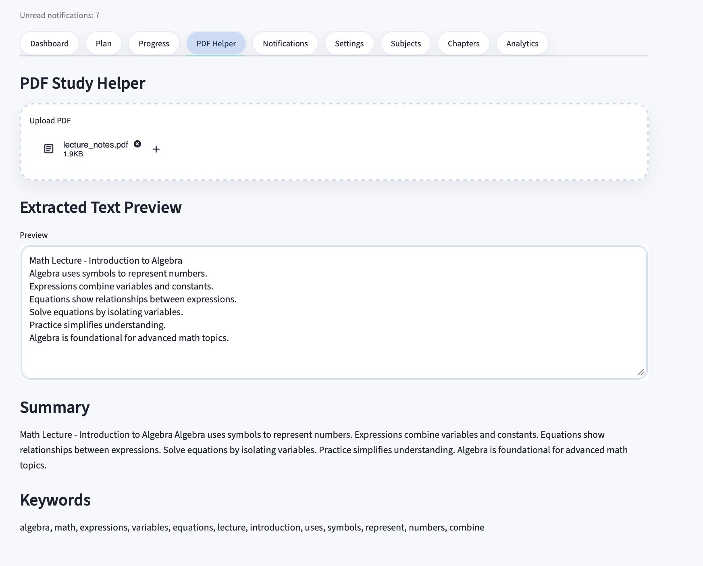
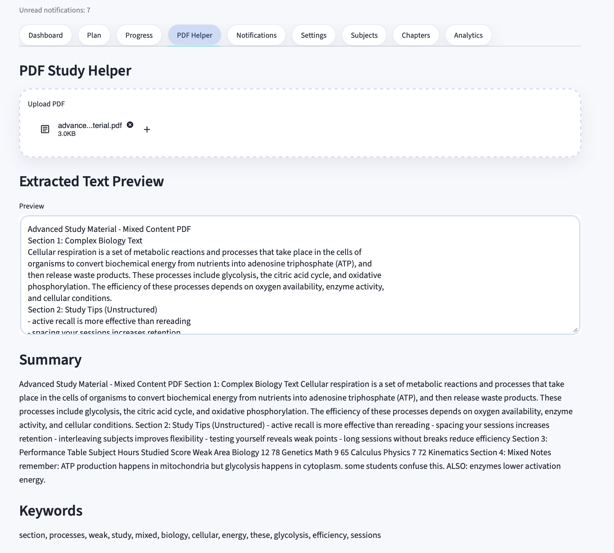

---

### Subjects Management
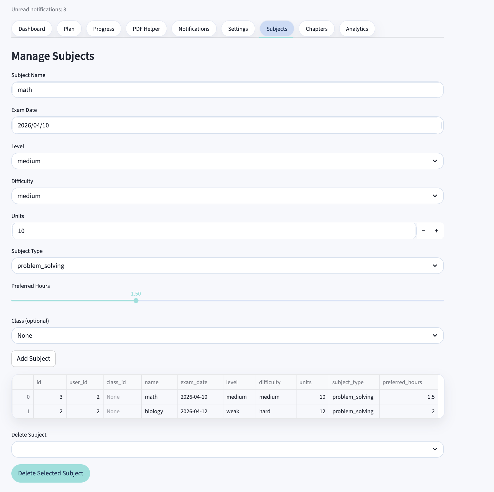

---

### Chapters Management
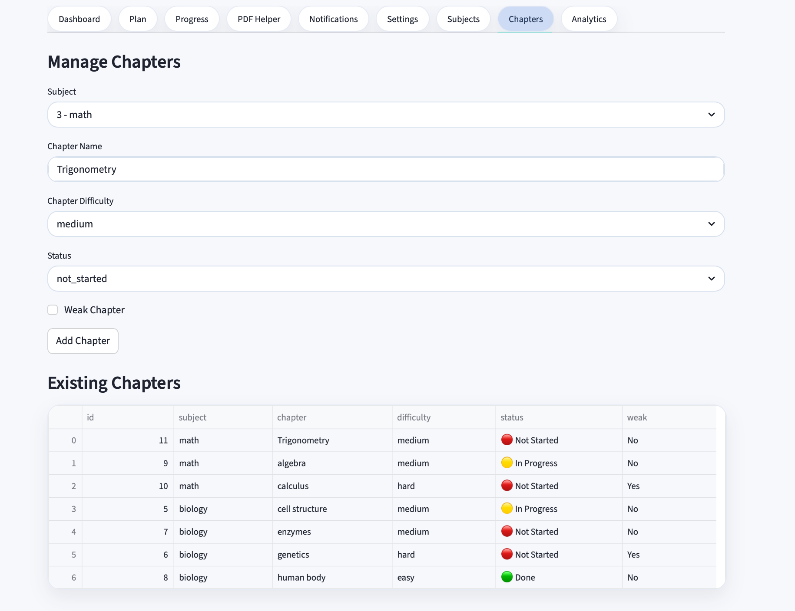

---

### Analytics & Insights
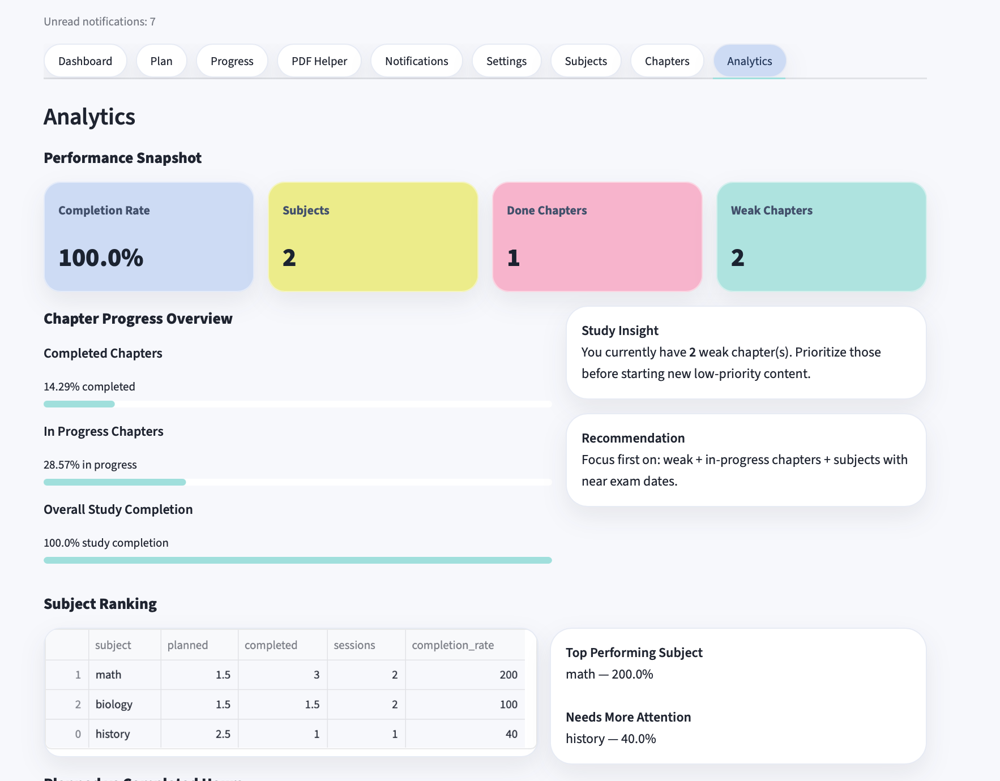
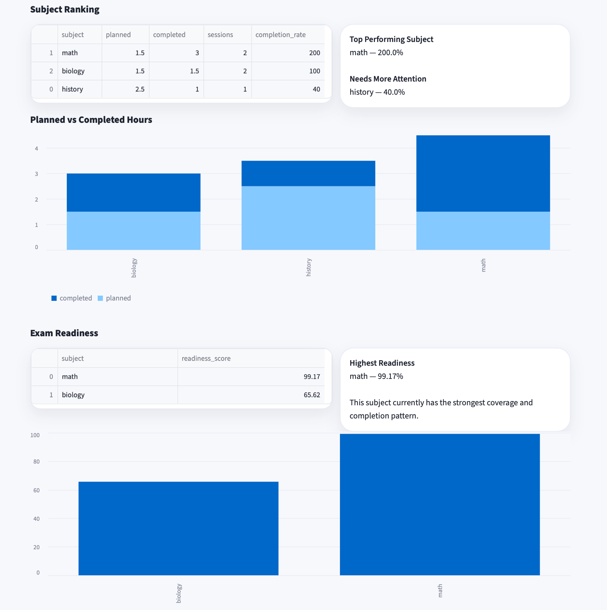
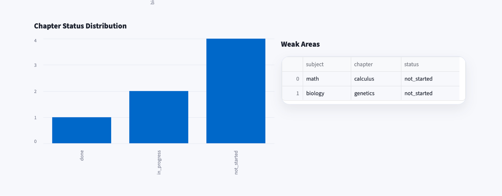


## ✨ Core Features

### 👤 Authentication System
- Secure login & registration
- Role-based access (Admin / Student / Teacher)

---

### 📚 Study Management
- Add subjects with:
  - Exam date
  - Difficulty level
  - Study units
- Add and manage chapters
- Mark chapters as:
  - Done
  - In progress
  - Weak

---

### 🧠 Smart Study Planning
- Automatically generates:
  - Daily plans
  - Weekly plans
- Prioritizes:
  - Weak chapters
  - Upcoming exams
  - Study balance

---

### 📊 Progress Tracking
- Track completion rate
- Monitor chapter status
- Visual feedback on performance

---

### 📈 Analytics Dashboard
- Completion insights
- Subject readiness scoring
- Weak vs strong areas detection
- System-level statistics (Admin)

---

### 📄 PDF Study Helper
- Upload study materials (PDF)
- Extract text
- Generate summaries
- Extract keywords

---

### 📤 Export System
- Export data as:
  - CSV
  - PDF reports

---

### 🔔 Notifications System
- Real-time feedback:
  - Subject added
  - Progress updates

---

## 🛠️ Tech Stack

- **Frontend / UI**: Streamlit
- **Backend Logic**: Python
- **Database**: SQLite
- **Data Handling**: Pandas
- **PDF Processing**: PyPDF2
- **PDF Export**: ReportLab

---

## 🧱 Project Structure
```plaintext
smart_study_planner/
│
├── app.py                # Main application (Streamlit entry)
├── planner.py            # Study planning logic
├── analytics.py          # Analytics & insights
├── storage.py            # Database operations
├── models.py             # Data models
├── auth.py               # Authentication system
├── pdf_helper.py         # PDF processing
├── export_helper.py      # Export (CSV / PDF)
├── db_init.py            # Database initialization
│
├── data/                 # Database & JSON files
│   ├── smart_study_planner.db
│   ├── subjects.json
│   ├── progress.json
│   └── settings.json
│
├── screenshots/          # README images
│   ├── 01-dashboard.png
│   ├── ...
│
├── styles.css            # UI styling
├── requirements.txt      # Dependencies
├── README.md             # Project documentation
│
├── .streamlit/           # Streamlit config
│   └── config.toml
│
└── .gitignore
---
```

## ⚙️ How to Run

### 1. Clone the repository

```bash
git clone https://github.com/roqaiasoliman9-create/NeuroPlan.git
cd NeuroPlan
```
### 2-  Create virtual environment
```bash
python -m venv .venv
source .venv/bin/activate
```

### 3- Install dependencies
```bash
- pip install -r requirements.txt
```
### 4- Run the app
```bash
streamlit run app.py
```
# 🧠 Why This Project Matters
This is not just a UI project — it demonstrates:
- Real-world problem solving
- Data-driven planning logic
- Multi-role system design
- lean modular architecture
- End-to-end product thinking

# 🔮 Future Improvements
- AI-based study recommendations
- Spaced repetition system
- Calendar integration
- Mobile-friendly version
- Advanced analytics with ML

# 👩‍💻 Author
Ruqaya Suleyman
AI Engineer (Beginner → Building Real Systems)

Built as part of an AI engineering journey focused on:
- Real applications
- Practical systems
- Strong portfolio projects

# 📌 Notes
- This project is designed for learning and portfolio purposes
- Can be extended into a full SaaS product